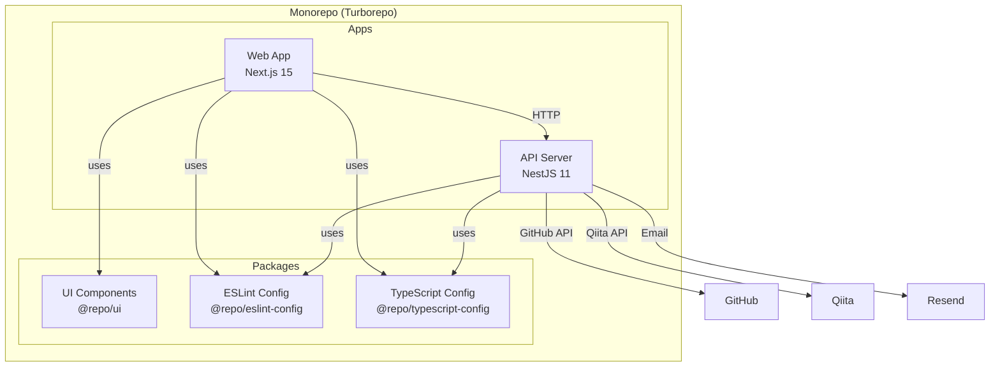
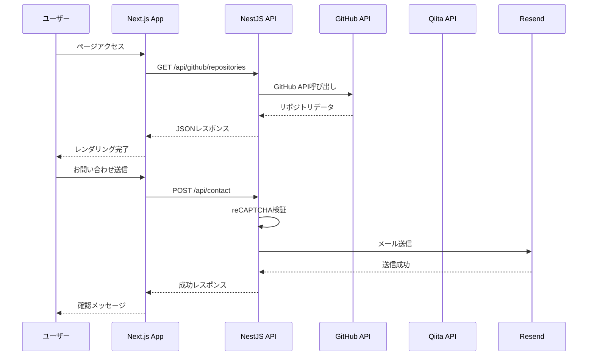

# Mirrorman Portfolio Site

> フルスタックエンジニアを目指す開発者のポートフォリオサイト

## 📋 概要

このプロジェクトは、フロントエンド（Next.js）とバックエンド（NestJS）を含むモノレポ構成のポートフォリオサイトです。Turborepoを使用して効率的なビルドと開発環境を提供し、GitHubとQiitaの情報を連携した動的なコンテンツを表示します。

### 主な機能

- **ホームページ**: GitHubリポジトリとQiita記事のサマリー表示
- **About Me**: 自己紹介と経歴の紹介
- **Portfolio**: GitHubリポジトリの詳細表示（言語別フィルタ、ソート機能、コントリビューショングラフ）
- **Article**: Qiita記事の一覧表示
- **Contact**: お問い合わせフォーム（reCAPTCHA対応）

## 🛠 技術スタック

### モノレポ・ビルドツール

- **[Turborepo](https://turborepo.org/)** - モノレポのビルドシステム  
  <svg xmlns="http://www.w3.org/2000/svg" width="120" height="40" viewBox="0 0 256 318"><title>Turborepo-icon SVG Icon</title><defs><linearGradient id="logosTurborepoIcon0" x1="123.779%" x2="123.779%" y1="0%" y2="698.962%"><stop offset="0%" stop-color="#1E90FF"/><stop offset="100%" stop-color="#FF1E56"/></linearGradient><linearGradient id="logosTurborepoIcon1" x1="11.486%" x2="11.486%" y1="-2.194%" y2="512.398%"><stop offset="0%" stop-color="#1E90FF"/><stop offset="100%" stop-color="#FF1E56"/></linearGradient><linearGradient id="logosTurborepoIcon2" x1="-153.743%" x2="-153.743%" y1="-62.263%" y2="278.479%"><stop offset="0%" stop-color="#1E90FF"/><stop offset="100%" stop-color="#FF1E56"/></linearGradient><linearGradient id="logosTurborepoIcon3" x1="-153.743%" x2="-153.743%" y1="-178.48%" y2="162.264%"><stop offset="0%" stop-color="#1E90FF"/><stop offset="100%" stop-color="#FF1E56"/></linearGradient><linearGradient id="logosTurborepoIcon4" x1="11.486%" x2="11.486%" y1="-412.397%" y2="102.194%"><stop offset="0%" stop-color="#1E90FF"/><stop offset="100%" stop-color="#FF1E56"/></linearGradient><linearGradient id="logosTurborepoIcon5" x1="123.779%" x2="123.779%" y1="-598.961%" y2="100%"><stop offset="0%" stop-color="#1E90FF"/><stop offset="100%" stop-color="#FF1E56"/></linearGradient></defs><path fill="url(#logosTurborepoIcon0)" d="M103.41.095C66.837-1.166 30.268 10.183 0 34.144l20.177 11.35c23.962-17.656 54.226-25.222 83.233-23.961z"/><path fill="url(#logosTurborepoIcon1)" d="M210.6 48.016c-25.222-26.483-58.01-42.877-93.319-46.66v21.438c30.268 5.044 56.75 18.916 78.188 40.355z"/><path fill="url(#logosTurborepoIcon2)" d="M256 151.424c-1.26-32.788-13.871-65.576-35.309-93.32l-15.136 15.133c17.657 23.96 27.747 50.444 29.008 78.187z"/><path fill="url(#logosTurborepoIcon3)" d="M220.691 259.877c21.438-27.744 34.049-60.532 35.309-93.32h-21.437c-1.26 27.744-11.351 54.227-29.008 78.187z"/><path fill="url(#logosTurborepoIcon4)" d="M117.281 316.626c34.049-3.783 68.097-20.178 93.32-46.66l-15.132-15.133c-21.437 22.7-49.185 36.571-78.188 40.354z"/><path fill="url(#logosTurborepoIcon5)" d="M0 283.838c30.268 23.96 66.837 35.31 103.41 34.049v-21.439c-29.007 1.262-58.01-6.305-83.233-23.96z"/><path d="M97.651 71.344c13.479 0 25.919 2.295 37.321 6.886c11.402 4.443 21.177 10.663 29.324 18.66c8.292 7.998 14.734 17.402 19.326 28.214c4.593 10.663 6.887 22.214 6.887 34.655c0 12.44-2.294 24.066-6.887 34.877c-4.592 10.663-11.034 19.993-19.326 27.99c-8.147 7.998-17.922 14.292-29.324 18.883c-11.402 4.443-23.842 6.665-37.32 6.665c-13.625 0-26.142-2.222-37.544-6.665c-11.257-4.591-20.954-10.885-29.101-18.882c-8.147-7.998-14.513-17.328-19.105-27.991c-4.592-10.811-6.887-22.437-6.887-34.877c0-12.44 2.295-23.992 6.887-34.655c4.592-10.812 10.958-20.216 19.105-28.213c8.147-7.998 17.844-14.218 29.101-18.66c11.402-4.592 23.92-6.887 37.543-6.887m0 42.208c-6.37 0-12.44 1.184-18.216 3.554c-5.626 2.222-10.59 5.406-14.884 9.553c-4.293 4.146-7.702 9.034-10.219 14.661c-2.516 5.628-3.776 11.774-3.776 18.439c0 6.664 1.26 12.81 3.776 18.438c2.517 5.628 5.926 10.515 10.22 14.662c4.293 4.147 9.257 7.404 14.883 9.774c5.776 2.222 11.846 3.332 18.216 3.332c6.37 0 12.368-1.11 17.994-3.332c5.776-2.37 10.813-5.627 15.106-9.774c4.443-4.147 7.925-9.034 10.441-14.662c2.516-5.628 3.777-11.774 3.777-18.438c0-6.665-1.26-12.811-3.777-18.439c-2.516-5.627-5.998-10.515-10.44-14.661c-4.294-4.147-9.331-7.331-15.107-9.553c-5.626-2.37-11.624-3.554-17.994-3.554"/></svg>

- **[pnpm](https://pnpm.io/)** - 高速なパッケージマネージャー  
  <svg xmlns="http://www.w3.org/2000/svg" width="120" height="40" viewBox="0 0 512 368"><title>Pnpm SVG Icon</title><path fill="#F9AD00" d="M512 126.274v114.794H397.206V126.274zM512 0v114.794H397.206V0zM385.726 0v114.794H270.932V0zM259.452 0v114.794H144.658V0z"/><path fill="#4E4E4E" d="M385.726 252.548v114.794H270.932V252.548zm126.274 0v114.794H397.206V252.548zm-252.548 0v114.794H144.658V252.548zm126.274-126.274v114.794H270.932V126.274zM21.503 159.77c3.857 0 7.441.498 10.752 1.494c3.31.997 6.155 2.524 8.534 4.58c2.378 2.058 4.243 4.645 5.593 7.763c1.35 3.118 2.025 6.83 2.025 11.138c0 4.114-.58 7.714-1.736 10.8c-1.157 3.085-2.797 5.673-4.918 7.762c-2.121 2.089-4.677 3.648-7.666 4.676c-2.99 1.029-6.316 1.543-9.98 1.543c-2.764 0-5.336-.418-7.714-1.253v16.007l-.156.044c-.648.18-1.625.375-2.93.582c-1.414.225-2.86.338-4.34.338c-1.414 0-2.683-.096-3.808-.29c-1.125-.192-2.073-.578-2.845-1.156c-.771-.579-1.35-1.366-1.735-2.363c-.386-.996-.579-2.298-.579-3.905v-46.285l.005-.343c.046-1.58.414-2.88 1.104-3.9c.74-1.093 1.752-2.09 3.037-2.99c1.993-1.285 4.468-2.314 7.425-3.085c2.957-.771 6.268-1.157 9.932-1.157m112.627 0c3.857 0 7.441.498 10.752 1.494c3.31.997 6.155 2.524 8.534 4.58c2.378 2.058 4.243 4.645 5.593 7.763c1.35 3.118 2.025 6.83 2.025 11.138c0 4.114-.579 7.714-1.736 10.8c-1.157 3.085-2.797 5.673-4.918 7.762c-2.121 2.089-4.677 3.648-7.666 4.676c-2.99 1.029-6.316 1.543-9.98 1.543c-2.764 0-5.336-.418-7.714-1.253v16.007l-.155.044c-.649.18-1.625.375-2.931.582c-1.414.225-2.86.338-4.34.338c-1.413 0-2.683-.096-3.808-.29c-1.125-.192-2.073-.578-2.845-1.156c-.771-.579-1.35-1.366-1.735-2.363c-.386-.996-.579-2.298-.579-3.905v-46.285l.005-.343c.046-1.58.414-2.88 1.104-3.9c.74-1.093 1.752-2.09 3.037-2.99c1.993-1.285 4.468-2.314 7.425-3.085c2.957-.771 6.268-1.157 9.932-1.157m-54.288 0c7.264 0 12.857 1.59 16.778 4.773c3.922 3.182 5.882 7.602 5.882 13.259v30.181l-.168.049c-.646.176-1.602.353-2.87.53c-1.381.193-2.812.29-4.29.29c-1.415 0-2.684-.097-3.81-.29c-1.124-.193-2.072-.579-2.844-1.157c-.771-.579-1.366-1.366-1.784-2.363c-.418-.996-.626-2.298-.626-3.905V178.38l-.005-.31c-.056-1.835-.617-3.194-1.683-4.077c-1.125-.932-2.652-1.398-4.58-1.398c-1.286 0-2.556.16-3.81.482c-1.253.321-2.33.803-3.23 1.446v33.46l-.168.049c-.646.176-1.602.353-2.869.53c-1.382.193-2.812.29-4.29.29c-1.415 0-2.685-.097-3.81-.29c-1.125-.193-2.073-.579-2.844-1.157c-.772-.579-1.366-1.366-1.784-2.363c-.418-.996-.627-2.298-.627-3.905V172.21l.005-.343c.046-1.58.414-2.88 1.104-3.9c.74-1.093 1.752-2.09 3.037-2.99c2.186-1.542 4.934-2.795 8.245-3.76c3.31-.964 6.99-1.446 11.04-1.446m141.266 0c2.443 0 4.837.321 7.184.964c2.346.643 4.435 1.655 6.267 3.038c1.833 1.382 3.295 3.214 4.388 5.496c1.093 2.282 1.64 5.062 1.64 8.34v30.375l-.17.049c-.645.176-1.601.353-2.868.53c-1.382.193-2.813.29-4.291.29c-1.415 0-2.684-.097-3.81-.29c-1.124-.193-2.072-.579-2.844-1.157c-.771-.579-1.366-1.366-1.784-2.363c-.418-.996-.627-2.298-.627-3.905v-23.046l-.005-.316c-.057-1.766-.602-3.059-1.634-3.879c-1.093-.867-2.571-1.301-4.435-1.301c-.9 0-1.865.209-2.893.626c-1.029.418-1.8.852-2.315 1.302c.065.257.097.498.097.723v32.737l-.184.049c-.7.176-1.683.353-2.95.53a30.29 30.29 0 0 1-4.195.29c-1.414 0-2.683-.097-3.808-.29c-1.125-.193-2.074-.579-2.845-1.157c-.771-.579-1.366-1.366-1.784-2.363c-.418-.996-.627-2.298-.627-3.905v-23.046l-.005-.3c-.059-1.774-.652-3.072-1.779-3.895c-1.189-.867-2.62-1.301-4.29-1.301c-1.158 0-2.154.176-2.99.53a22.25 22.25 0 0 0-2.121 1.013v33.845l-.169.049c-.645.176-1.602.353-2.869.53c-1.382.193-2.812.29-4.29.29c-1.415 0-2.685-.097-3.81-.29c-1.125-.193-2.073-.579-2.844-1.157c-.772-.579-1.366-1.366-1.784-2.363c-.418-.996-.627-2.298-.627-3.905v-29.12l.005-.343c.046-1.576.414-2.844 1.104-3.804c.74-1.029 1.752-1.993 3.037-2.893c2.186-1.543 4.902-2.796 8.149-3.76c3.246-.965 6.637-1.447 10.173-1.447c2.635 0 5.223.37 7.762 1.109c2.54.739 4.741 1.848 6.605 3.326c1.929-1.285 4.098-2.346 6.51-3.182c2.41-.835 5.319-1.253 8.726-1.253M22.082 172.596c-1.222 0-2.314.144-3.279.434c-.964.289-1.8.626-2.507 1.012v21.214l.391.188c.661.303 1.366.562 2.116.776c.9.257 1.865.386 2.893.386c6.621 0 9.932-3.953 9.932-11.86c0-4.115-.82-7.168-2.459-9.161c-1.639-1.993-4.001-2.99-7.087-2.99m112.627 0c-1.221 0-2.314.144-3.279.434c-.964.289-1.8.626-2.507 1.012v21.214l.391.188c.661.303 1.366.562 2.116.776c.9.257 1.865.386 2.893.386c6.622 0 9.932-3.953 9.932-11.86c0-4.115-.82-7.168-2.459-9.161c-1.639-1.993-4.001-2.99-7.087-2.99"/></svg>

### フロントエンド

- **[Next.js 15](https://nextjs.org/)** - Reactフレームワーク（App Router）  
  <svg xmlns="http://www.w3.org/2000/svg" width="120" height="40" viewBox="0 0 256 256"><title>Nextjs-icon SVG Icon</title><defs><linearGradient id="logosNextjsIcon0" x1="55.633%" x2="83.228%" y1="56.385%" y2="96.08%"><stop offset="0%" stop-color="#FFF"/><stop offset="100%" stop-color="#FFF" stop-opacity="0"/></linearGradient><linearGradient id="logosNextjsIcon1" x1="50%" x2="49.953%" y1="0%" y2="73.438%"><stop offset="0%" stop-color="#FFF"/><stop offset="100%" stop-color="#FFF" stop-opacity="0"/></linearGradient><circle id="logosNextjsIcon2" cx="128" cy="128" r="128"/></defs><mask id="logosNextjsIcon3" fill="#fff"><use href="#logosNextjsIcon2"/></mask><g mask="url(#logosNextjsIcon3)"><circle cx="128" cy="128" r="128"/><path fill="url(#logosNextjsIcon0)" d="M212.634 224.028L98.335 76.8H76.8v102.357h17.228V98.68L199.11 234.446a128.433 128.433 0 0 0 13.524-10.418"/><path fill="url(#logosNextjsIcon1)" d="M163.556 76.8h17.067v102.4h-17.067z"/></g></svg>

- **[React 19](https://react.dev/)** - UIライブラリ  
  

- **[TypeScript 5.9](https://www.typescriptlang.org/)** - 型安全なJavaScript  
  

- **[styled-components](https://styled-components.com/)** - CSS-in-JS  
  

### バックエンド

- **[NestJS 11](https://nestjs.com/)** - Node.jsフレームワーク  
  

- **[Node.js](https://nodejs.org/)** - JavaScriptランタイム  
  

### フォーム・バリデーション

- **[React Hook Form](https://react-hook-form.com/)** - フォーム管理  
  

- **[Zod](https://zod.dev/)** - スキーマバリデーション  
  

### テスト

- **[Vitest](https://vitest.dev/)** - ユニットテスト・コンポーネントテスト  
  

- **[Playwright](https://playwright.dev/)** - E2Eテスト  
  

- **[Jest](https://jestjs.io/)** - バックエンドテスト  
  

### その他

- **[Docker](https://www.docker.com/)** - コンテナ化  
  

- **[ESLint](https://eslint.org/)** - コードリンティング  
  

- **[Prettier](https://prettier.io/)** - コードフォーマッター  
  

## 🚀 環境構築手順

### 必要条件

- **Node.js**: >= 18
- **pnpm**: 9.0.0（推奨）
- **Docker**: オプション（Docker Compose使用時）

### セットアップ

1. **リポジトリのクローン**

```bash
git clone <リポジトリURL>
cd myportfoliosite
```

2. **pnpmのインストール**

```bash
# npm経由でインストール
npm install -g pnpm@9.0.0

# またはHomebrew（macOS）
brew install pnpm
```

3. **依存関係のインストール**

```bash
pnpm install
```

4. **環境変数の設定**

ルートディレクトリに `.env` ファイルを作成し、必要な環境変数を設定してください。

```bash
# フロントエンド用（apps/web/.env.local）
NEXT_PUBLIC_API_BASE_URL=http://localhost:3001
RECAPTCHA_SITE_KEY=your_recaptcha_site_key

# バックエンド用（apps/api/.env）
NODE_ENV=development
PORT=3001
GITHUB_USERNAME=your_github_username
GITHUB_TOKEN=your_github_token  # オプション
QIITA_USER_ID=your_qiita_user_id
QIITA_TOKEN=your_qiita_token  # オプション
RECAPTCHA_SECRET_KEY=your_recaptcha_secret_key
RESEND_API_KEY=your_resend_api_key  # オプション
RESEND_FROM=noreply@example.com
RESEND_TO=admin@example.com
```

5. **開発サーバーの起動**

```bash
# 全アプリを起動
pnpm dev

# または特定のアプリのみ起動
pnpm --filter web dev    # フロントエンドのみ（http://localhost:3000）
pnpm --filter api dev    # バックエンドのみ（http://localhost:3001）
```

6. **Docker Composeを使用する場合**

```bash
docker-compose up
```

- フロントエンド: http://localhost:3000
- バックエンド: http://localhost:3001

## 📁 プロジェクト構成図



## 📂 ディレクトリ構成

```
myportfoliosite/
├── apps/
│   ├── api/              # バックエンドAPI（NestJS）
│   │   ├── src/
│   │   │   ├── modules/  # 機能モジュール
│   │   │   │   ├── github/
│   │   │   │   ├── qiita/
│   │   │   │   ├── contact/
│   │   │   │   ├── cache/
│   │   │   │   ├── health/
│   │   │   │   └── metrics/
│   │   │   ├── common/   # 共通機能
│   │   │   └── main.ts
│   │   └── test/         # E2Eテスト
│   │
│   └── web/              # フロントエンド（Next.js）
│       ├── app/          # App Router
│       │   ├── page.tsx  # ホーム
│       │   ├── about/    # About Me
│       │   ├── portfolio/# Portfolio
│       │   ├── article/  # Article
│       │   ├── contact/  # Contact
│       │   └── api/      # API Routes
│       ├── components/   # Reactコンポーネント
│       │   ├── features/ # 機能コンポーネント
│       │   ├── sections/ # セクションコンポーネント
│       │   ├── layouts/  # レイアウトコンポーネント
│       │   └── navigation/# ナビゲーション
│       ├── lib/          # ユーティリティ
│       ├── styles/       # スタイル設定
│       ├── tests/        # E2Eテスト（Playwright）
│       └── __tests__/    # ユニットテスト（Vitest）
│
├── packages/
│   ├── ui/               # 共通UIコンポーネント
│   ├── eslint-config/    # ESLint設定
│   └── typescript-config/# TypeScript設定
│
├── docker-compose.yml     # Docker Compose設定
├── turbo.json            # Turborepo設定
├── pnpm-workspace.yaml   # pnpmワークスペース設定
└── package.json          # ルートパッケージ設定
```

## 🏗 アーキテクチャ



## 📝 コマンド一覧

### ルートディレクトリ

```bash
# 開発サーバー起動（全アプリ）
pnpm dev

# ビルド（全アプリ）
pnpm build

# リント（全アプリ）
pnpm lint

# 型チェック（全アプリ）
pnpm check-types

# テスト（全アプリ）
pnpm test

# コードフォーマット
pnpm format
```

### フロントエンド（apps/web）

```bash
# 開発サーバー起動
pnpm --filter web dev

# ビルド
pnpm --filter web build

# リント
pnpm --filter web lint

# ユニットテスト
pnpm --filter web test

# E2Eテスト
pnpm --filter web e2e
```

### バックエンド（apps/api）

```bash
# 開発サーバー起動
pnpm --filter api dev

# ビルド
pnpm --filter api build

# ユニットテスト
pnpm --filter api test

# E2Eテスト
pnpm --filter api test:e2e
```

## 🧪 テスト戦略

- **ユニットテスト**: Vitest（フロントエンド）、Jest（バックエンド）
- **E2Eテスト**: Playwright（フロントエンド）、Jest（バックエンド）
- **テストカバレッジ**: 重要ドメインを優先、数値の最大化は目的化しない

## 📄 ライセンス

このプロジェクトは個人ポートフォリオサイトであり、オープンソースライセンスは適用されていません。

## 🔗 関連リンク

- [Next.js Documentation](https://nextjs.org/docs)
- [NestJS Documentation](https://docs.nestjs.com/)
- [Turborepo Documentation](https://turborepo.org/docs)
- [pnpm Documentation](https://pnpm.io/motivation)
