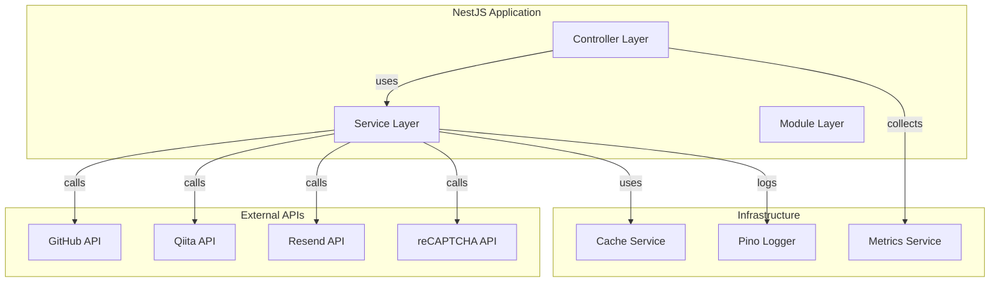
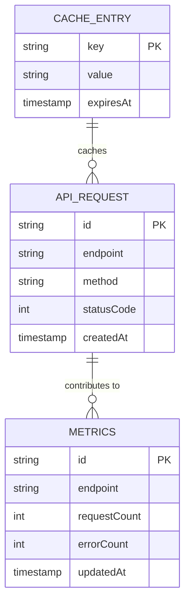

# Portfolio API

> NestJSベースのポートフォリオサイト用バックエンドAPI

## 📋 概要

ポートフォリオサイトのバックエンドAPIサーバーです。GitHub APIとQiita APIとの連携、お問い合わせフォームの処理、キャッシュ管理、メトリクス収集などの機能を提供します。

## 🛠 技術スタック

### フレームワーク・ランタイム

- **[NestJS 11](https://nestjs.com/)** - Node.jsフレームワーク  
  

- **[TypeScript 5.9](https://www.typescriptlang.org/)** - 型安全なJavaScript  
  

- **[Node.js](https://nodejs.org/)** - JavaScriptランタイム  
  

### 主要ライブラリ

- **[Zod](https://zod.dev/)** - スキーマバリデーション  
  

- **[Joi](https://joi.dev/)** - 環境変数バリデーション  
  

- **[Pino](https://getpino.io/)** - 構造化ログ  
  

- **[Resend](https://resend.com/)** - メール送信サービス  
  

- **[Helmet](https://helmetjs.github.io/)** - セキュリティヘッダー  
  

## ✨ 機能

### GitHub API連携

- **リポジトリ一覧取得**: `GET /api/github/repositories?limit=20`
  - GitHubリポジトリの情報を取得
  - 言語別の統計情報を含む
  - ページネーション対応
- **レート制限情報取得**: `GET /api/github/rate-limit`
  - GitHub APIのレート制限状況を確認

### Qiita API連携

- **記事一覧取得**: `GET /api/qiita/articles?limit=10`
  - Qiita記事の情報を取得
  - ページネーション対応
- **レート制限情報取得**: `GET /api/qiita/rate-limit`
  - Qiita APIのレート制限状況を確認

### お問い合わせフォーム

- **メール送信**: `POST /api/contact`
  - reCAPTCHA検証
  - メール送信（Resend経由）
  - 入力バリデーション（Zod）

### ヘルスチェック・メトリクス

- **ヘルスチェック**: `GET /api/health`
  - サービスの稼働状況確認
- **メトリクス取得**: `GET /api/metrics`
  - API呼び出し回数、エラー率などの統計情報

### キャッシュ戦略

- GitHub/Qiita APIのレスポンスを15分間キャッシュ
- エラー時は1時間のstaleキャッシュからフォールバック
- レート制限情報もキャッシュして管理

### エラーハンドリング

- グローバル例外フィルターで統一されたエラーレスポンス
- レート制限エラーの適切な処理
- タイムアウトとリトライ機能

## 🚀 環境構築手順

### 必要条件

- **Node.js**: >= 18
- **pnpm**: 9.0.0

### セットアップ

1. **依存関係のインストール**

```bash
# ルートディレクトリから
pnpm install

# またはapiディレクトリで直接
cd apps/api
pnpm install
```

2. **環境変数の設定**

`apps/api/.env` ファイルを作成し、以下の環境変数を設定してください。

```bash
# Node環境
NODE_ENV=development  # development | test | production

# サーバー設定
PORT=3001

# GitHub API設定
GITHUB_TOKEN=        # GitHubパーソナルアクセストークン（オプション）
GITHUB_USERNAME=     # GitHubユーザー名（必須）

# Qiita API設定
QIITA_TOKEN=         # Qiitaアクセストークン（オプション）
QIITA_USER_ID=       # QiitaユーザーID（必須）

# reCAPTCHA設定
RECAPTCHA_SECRET_KEY=  # reCAPTCHA Secret Key（オプション）

# Resend設定（メール送信用）
RESEND_API_KEY=      # Resend API Key（オプション）
RESEND_FROM=         # 送信元メールアドレス
RESEND_TO=           # 送信先メールアドレス
```

3. **開発サーバーの起動**

```bash
# ルートディレクトリから
pnpm --filter api dev

# またはapiディレクトリで直接
cd apps/api
pnpm dev
```

4. **ビルド**

```bash
pnpm --filter api build
```

5. **本番サーバーの起動**

```bash
pnpm --filter api start:prod
```

## 📁 ディレクトリ構成

```
apps/api/
├── src/
│   ├── modules/           # 機能モジュール
│   │   ├── github/        # GitHub API連携
│   │   │   ├── github.controller.ts
│   │   │   ├── github.service.ts
│   │   │   └── github.module.ts
│   │   ├── qiita/         # Qiita API連携
│   │   │   ├── qiita.controller.ts
│   │   │   ├── qiita.service.ts
│   │   │   └── qiita.module.ts
│   │   ├── contact/      # お問い合わせフォーム
│   │   │   ├── contact.controller.ts
│   │   │   ├── contact.service.ts
│   │   │   ├── contact.dto.ts
│   │   │   ├── mail.service.ts
│   │   │   ├── recaptcha.service.ts
│   │   │   └── contact.module.ts
│   │   ├── cache/         # キャッシュサービス
│   │   │   ├── cache.service.ts
│   │   │   └── cache.module.ts
│   │   ├── health/        # ヘルスチェック
│   │   │   ├── health.controller.ts
│   │   │   └── health.module.ts
│   │   └── metrics/       # メトリクス収集
│   │       ├── metrics.controller.ts
│   │       ├── metrics.service.ts
│   │       └── metrics.module.ts
│   ├── common/            # 共通機能
│   │   ├── filters/      # 例外フィルター
│   │   │   └── http-exception.filter.ts
│   │   ├── interceptors/ # インターセプター
│   │   │   └── metrics.interceptor.ts
│   │   ├── middleware/   # ミドルウェア
│   │   │   └── security.middleware.ts
│   │   └── metrics/       # メトリクスサービス
│   │       └── metrics.service.ts
│   ├── constants/        # 定数定義
│   │   └── constants.ts
│   ├── app.module.ts     # ルートモジュール
│   ├── app.controller.ts # ルートコントローラー
│   ├── app.service.ts    # ルートサービス
│   └── main.ts           # エントリーポイント
├── test/                 # E2Eテスト
│   ├── app.e2e-spec.ts
│   ├── github.e2e-spec.ts
│   ├── qiita.e2e-spec.ts
│   ├── contact.e2e-spec.ts
│   └── jest-e2e.json
├── Dockerfile            # Docker設定
├── nest-cli.json        # NestJS CLI設定
├── tsconfig.json        # TypeScript設定
└── package.json         # パッケージ設定
```

## 🏗 アーキテクチャ図



## 📊 ER図



## 🔌 API エンドポイント

### GitHub API

| メソッド | エンドポイント | 説明 |
|---------|--------------|------|
| GET | `/api/github/repositories?limit=20` | GitHubリポジトリ一覧取得 |
| GET | `/api/github/rate-limit` | GitHubレート制限情報取得 |

### Qiita API

| メソッド | エンドポイント | 説明 |
|---------|--------------|------|
| GET | `/api/qiita/articles?limit=10` | Qiita記事一覧取得 |
| GET | `/api/qiita/rate-limit` | Qiitaレート制限情報取得 |

### Contact API

| メソッド | エンドポイント | 説明 |
|---------|--------------|------|
| POST | `/api/contact` | お問い合わせフォーム送信 |

### Health & Metrics

| メソッド | エンドポイント | 説明 |
|---------|--------------|------|
| GET | `/api/health` | ヘルスチェック |
| GET | `/api/metrics` | メトリクス情報取得 |

## 🧪 テスト

### ユニットテスト

```bash
# テスト実行
pnpm --filter api test

# ウォッチモード
pnpm --filter api test:watch

# カバレッジ
pnpm --filter api test:cov
```

### E2Eテスト

```bash
# E2Eテスト実行
pnpm --filter api test:e2e
```

## 📝 コマンド一覧

```bash
# 開発サーバー起動
pnpm dev                    # ルートから
pnpm --filter api dev      # フィルタ使用

# ビルド
pnpm --filter api build

# リント
pnpm --filter api lint

# フォーマット
pnpm --filter api format

# テスト
pnpm --filter api test           # ユニットテスト
pnpm --filter api test:e2e       # E2Eテスト
pnpm --filter api test:cov       # カバレッジ付きテスト

# 本番起動
pnpm --filter api start:prod
```

## 🔒 セキュリティ

- **Helmet**: セキュリティヘッダーの設定
- **CORS**: クロスオリジンリクエストの制御
- **入力バリデーション**: ZodとJoiによる厳密な検証
- **reCAPTCHA**: スパム対策

## 📈 ログ

- **Pino**: 構造化ログを採用
- **開発環境**: プレティプリント（カラー出力）
- **本番環境**: JSON形式

## 📄 ライセンス

このプロジェクトは個人ポートフォリオサイトであり、オープンソースライセンスは適用されていません。

## 🔗 関連リンク

- [NestJS Documentation](https://docs.nestjs.com/)
- [GitHub API Documentation](https://docs.github.com/en/rest)
- [Qiita API Documentation](https://qiita.com/api/v2/docs)
