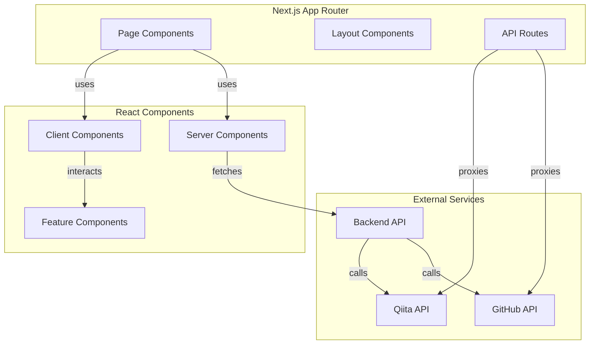
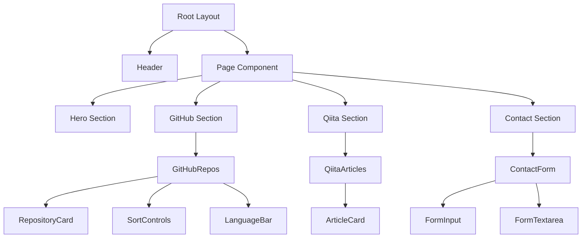

# Portfolio Web App

> Next.js 15とReact 19を使用したポートフォリオサイトのフロントエンド

## 📋 概要

ポートフォリオサイトのフロントエンドアプリケーションです。Next.js 15のApp Routerを使用し、Server Componentsを活用したパフォーマンス最適化された構成になっています。GitHubリポジトリとQiita記事を動的に表示し、お問い合わせフォームを提供します。

## 🛠 技術スタック

### フレームワーク・ライブラリ

- **[Next.js 15](https://nextjs.org/)** - Reactフレームワーク（App Router）  
  <svg xmlns="http://www.w3.org/2000/svg" width="120" height="40" viewBox="0 0 256 256"><title>Nextjs-icon SVG Icon</title><defs><linearGradient id="logosNextjsIcon0" x1="55.633%" x2="83.228%" y1="56.385%" y2="96.08%"><stop offset="0%" stop-color="#FFF"/><stop offset="100%" stop-color="#FFF" stop-opacity="0"/></linearGradient><linearGradient id="logosNextjsIcon1" x1="50%" x2="49.953%" y1="0%" y2="73.438%"><stop offset="0%" stop-color="#FFF"/><stop offset="100%" stop-color="#FFF" stop-opacity="0"/></linearGradient><circle id="logosNextjsIcon2" cx="128" cy="128" r="128"/></defs><mask id="logosNextjsIcon3" fill="#fff"><use href="#logosNextjsIcon2"/></mask><g mask="url(#logosNextjsIcon3)"><circle cx="128" cy="128" r="128"/><path fill="url(#logosNextjsIcon0)" d="M212.634 224.028L98.335 76.8H76.8v102.357h17.228V98.68L199.11 234.446a128.433 128.433 0 0 0 13.524-10.418"/><path fill="url(#logosNextjsIcon1)" d="M163.556 76.8h17.067v102.4h-17.067z"/></g></svg>

- **[React 19](https://react.dev/)** - UIライブラリ  
  

- **[TypeScript 5.9](https://www.typescriptlang.org/)** - 型安全なJavaScript  
  

- **[styled-components 6](https://styled-components.com/)** - CSS-in-JS  
  

### 主要ライブラリ

- **[React Hook Form](https://react-hook-form.com/)** - フォーム管理  
  

- **[Zod](https://zod.dev/)** - スキーマバリデーション  
  

- **[react-google-recaptcha](https://www.npmjs.com/package/react-google-recaptcha)** - reCAPTCHA統合  
  <svg xmlns="http://www.w3.org/2000/svg" width="120" height="40" viewBox="0 0 256 244"><title>Recaptcha SVG Icon</title><path fill="#1C3AA9" d="M211.3 84.966a87.114 87.114 0 0 0-.087-3.653V12.251l-19.092 19.093C176.494 12.217 152.723 0 126.096 0C98.387 0 73.77 13.226 58.21 33.71l31.295 31.624a41.463 41.463 0 0 1 12.677-14.224c5.464-4.263 13.205-7.75 23.914-7.75c1.294 0 2.293.152 3.026.436c13.269 1.048 24.77 8.37 31.541 18.998L138.51 84.946c28.059-.11 59.756-.174 72.788.015"/><path fill="#4285F4" d="M125.599.003a87.114 87.114 0 0 0-3.653.087H52.884l19.093 19.093C52.85 34.809 40.633 58.581 40.633 85.207c0 27.71 13.226 52.327 33.71 67.888l31.624-31.295a41.463 41.463 0 0 1-14.224-12.678c-4.263-5.463-7.75-13.205-7.75-23.914c0-1.293.152-2.292.436-3.026c1.048-13.268 8.37-24.769 18.998-31.54l22.152 22.152c-.11-28.06-.175-59.757.015-72.789"/><path fill="#ABABAB" d="M40.636 85.205c.004 1.224.032 2.441.087 3.653v69.062l19.093-19.093c15.626 19.127 39.398 31.344 66.024 31.344c27.71 0 52.327-13.226 67.888-33.71l-31.295-31.624a41.463 41.463 0 0 1-12.678 14.224c-5.463 4.263-13.205 7.75-23.914 7.75c-1.293 0-2.292-.152-3.026-.437c-13.268-1.047-24.769-8.37-31.54-18.997l22.152-22.153c-28.06.11-59.757.175-72.789-.014"/><path fill="#A6A6A6" d="M55.013 203.168c-2.075 0-3.936.393-5.582 1.18a11.572 11.572 0 0 0-4.187 3.302c-1.127 1.431-1.995 3.167-2.603 5.206c-.59 2.022-.886 4.285-.886 6.79v7.22c0 2.522.296 4.794.886 6.816c.608 2.022 1.467 3.748 2.577 5.18c1.109 1.43 2.45 2.531 4.025 3.3c1.574.77 3.346 1.155 5.314 1.155c2.022 0 3.793-.296 5.314-.886c1.539-.59 2.827-1.44 3.864-2.55c1.038-1.127 1.834-2.486 2.389-4.079c.573-1.592.912-3.4 1.02-5.421h-4.965c-.125 1.556-.34 2.89-.644 3.999c-.304 1.091-.752 1.995-1.342 2.71c-.573.698-1.324 1.217-2.255 1.557c-.912.322-2.04.483-3.381.483c-1.431 0-2.648-.313-3.65-.94c-1.002-.644-1.816-1.52-2.442-2.63c-.608-1.109-1.056-2.406-1.342-3.891c-.268-1.485-.403-3.086-.403-4.804v-7.273c0-1.843.161-3.516.483-5.019c.34-1.502.85-2.782 1.53-3.837c.68-1.056 1.539-1.87 2.577-2.443c1.037-.59 2.272-.885 3.703-.885c1.199 0 2.228.179 3.086.537a5.01 5.01 0 0 1 2.147 1.61c.573.715 1.011 1.628 1.315 2.737c.305 1.11.51 2.433.618 3.972h4.965c-.09-2.111-.42-3.98-.993-5.609c-.573-1.628-1.369-2.997-2.389-4.106c-1.02-1.11-2.263-1.95-3.73-2.523c-1.45-.572-3.122-.859-5.019-.859zm121.2 0c-2.076 0-3.937.393-5.583 1.18a11.572 11.572 0 0 0-4.187 3.302c-1.127 1.431-1.994 3.167-2.603 5.206c-.59 2.022-.885 4.285-.885 6.79v7.22c0 2.522.295 4.794.885 6.816c.608 2.022 1.467 3.748 2.577 5.18c1.109 1.43 2.45 2.531 4.025 3.3c1.575.77 3.346 1.155 5.314 1.155c2.022 0 3.793-.296 5.314-.886c1.539-.59 2.827-1.44 3.865-2.55c1.037-1.127 1.833-2.486 2.388-4.079c.573-1.592.913-3.4 1.02-5.421h-4.965c-.125 1.556-.34 2.89-.644 3.999c-.304 1.091-.751 1.995-1.342 2.71c-.572.698-1.324 1.217-2.254 1.557c-.913.322-2.04.483-3.382.483c-1.431 0-2.648-.313-3.65-.94c-1.002-.644-1.816-1.52-2.442-2.63c-.608-1.109-1.055-2.406-1.342-3.891c-.268-1.485-.402-3.086-.402-4.804v-7.273c0-1.843.16-3.516.483-5.019c.34-1.502.85-2.782 1.53-3.837c.68-1.056 1.538-1.87 2.576-2.443c1.038-.59 2.272-.885 3.703-.885c1.2 0 2.228.179 3.087.537c.858.34 1.574.876 2.147 1.61c.572.715 1.01 1.628 1.315 2.737c.304 1.11.51 2.433.617 3.972h4.965c-.09-2.111-.42-3.98-.993-5.609c-.573-1.628-1.369-2.997-2.389-4.106c-1.02-1.11-2.263-1.95-3.73-2.523c-1.45-.572-3.122-.859-5.019-.859zm-92.911.537L70.715 242.78h5.045l3.033-10.199h13.204l3.086 10.199h5.046l-12.614-39.075zm22.14 0v39.075h4.911v-15.298h7.541c1.879 0 3.543-.26 4.992-.778c1.45-.537 2.666-1.306 3.65-2.308c1.002-1.002 1.753-2.237 2.254-3.704c.52-1.485.779-3.166.779-5.045c0-1.736-.26-3.328-.779-4.777c-.5-1.467-1.243-2.729-2.227-3.784c-.984-1.074-2.21-1.906-3.677-2.496c-1.45-.59-3.113-.886-4.992-.886zm27.884 0v4.24h10.252v34.835h4.91v-34.835h10.28v-4.24zm61.646 0v39.075h4.91v-18.062h15.728v18.062h4.938v-39.075h-4.938v16.8h-15.727v-16.8zm44.2 0l-12.586 39.075h5.046l3.032-10.199h13.204l3.087 10.199H256l-12.614-39.075zm-128.82 4.24h7.542c1.199 0 2.218.214 3.06.644c.858.43 1.556 1.002 2.093 1.718a6.9 6.9 0 0 1 1.207 2.495c.269.93.403 1.897.403 2.899c0 1.11-.134 2.129-.403 3.06a6.412 6.412 0 0 1-1.207 2.388c-.537.662-1.235 1.18-2.094 1.556c-.84.376-1.86.564-3.06.564h-7.54zm-24.958 2.63l5.341 17.766H80.081zm155.872 0l5.34 17.766h-10.654zm-231.175 2.63c-1.235 0-2.3.313-3.194.94c-.877.626-1.61 1.476-2.2 2.549l-.081-2.952H0v29.038h4.75v-20.773c.448-1.235 1.083-2.21 1.906-2.925c.84-.716 1.905-1.074 3.193-1.074c.412 0 .779.018 1.1.054c.323.018.672.062 1.047.134l-.026-4.616a1.628 1.628 0 0 0-.35-.108a3.08 3.08 0 0 0-.482-.134a5.342 5.342 0 0 0-.564-.08a2.49 2.49 0 0 0-.483-.054zm15.968 0c-1.378 0-2.71.242-3.999.725c-1.288.483-2.433 1.279-3.435 2.388c-.984 1.092-1.78 2.523-2.388 4.294c-.609 1.754-.913 3.91-.913 6.468v3.274c0 2.219.26 4.142.779 5.77c.518 1.628 1.26 2.98 2.227 4.053a9.176 9.176 0 0 0 3.57 2.362c1.395.519 2.96.778 4.696.778c1.252 0 2.37-.125 3.355-.376c1.002-.25 1.887-.572 2.657-.966a9.324 9.324 0 0 0 1.986-1.395a10.676 10.676 0 0 0 1.422-1.61l-2.469-3.006c-.394.483-.814.93-1.261 1.341c-.448.394-.94.743-1.476 1.047a7.733 7.733 0 0 1-1.772.671a8.985 8.985 0 0 1-2.173.242c-2.201 0-3.892-.707-5.073-2.12c-1.163-1.414-1.744-3.677-1.744-6.79v-.672h16.21v-2.764c0-2.218-.188-4.178-.564-5.877c-.376-1.7-.975-3.131-1.798-4.294a7.796 7.796 0 0 0-3.167-2.63c-1.288-.609-2.845-.913-4.67-.913m0 4.08c1.038 0 1.897.187 2.577.563a4.15 4.15 0 0 1 1.61 1.583c.411.68.707 1.494.886 2.443c.196.93.322 1.959.375 3.086v.644H20.074c.072-1.628.269-2.979.59-4.053c.323-1.073.743-1.923 1.262-2.549c.537-.644 1.154-1.091 1.852-1.342a6.706 6.706 0 0 1 2.281-.376z"/></svg>

### テスト・開発ツール

- **[Vitest](https://vitest.dev/)** - ユニットテスト・コンポーネントテスト  
  

- **[Playwright](https://playwright.dev/)** - E2Eテスト  
  

- **[Testing Library](https://testing-library.com/)** - Reactコンポーネントテスト  
  

## ✨ 機能

### ページ構成

1. **ホーム (`/`)**
   - ヒーローセクション
   - GitHubリポジトリのサマリー（6件）
   - Qiita記事のサマリー（6件）

2. **About Me (`/about`)**
   - 自己紹介
   - 経歴・スキル紹介
   - 構造化データ（Person）によるSEO最適化

3. **Portfolio (`/portfolio`)**
   - GitHubリポジトリ一覧（20件）
   - 言語別フィルタリング
   - ソート機能（スター数、更新日時、作成日時）
   - 技術タグ表示
   - GitHubコントリビューショングラフ

4. **Article (`/article`)**
   - Qiita記事一覧（10件）
   - Qiitaプロフィール表示
   - 記事カード表示

5. **Contact (`/contact`)**
   - お問い合わせフォーム
   - reCAPTCHA統合
   - フォームバリデーション（Zod + React Hook Form）

### 主な機能

- **Server Components**: 可能な限りServer Componentを使用
- **Suspense**: データ取得の非同期処理とローディング状態管理
- **Skeleton Loading**: ローディング中のスケルトンUI
- **エラーハンドリング**: エラー状態の表示とリトライ機能
- **SEO最適化**: メタデータ、構造化データ、OGP画像
- **アクセシビリティ**: ARIA属性、キーボードナビゲーション対応
- **レスポンシブデザイン**: モバイル・タブレット・デスクトップ対応

## 🚀 環境構築手順

### 必要条件

- **Node.js**: >= 18
- **pnpm**: 9.0.0

### セットアップ

1. **依存関係のインストール**

```bash
# ルートディレクトリから
pnpm install

# またはwebディレクトリで直接
cd apps/web
pnpm install
```

2. **環境変数の設定**

`apps/web/.env.local` ファイルを作成し、以下の環境変数を設定してください。

```bash
# APIベースURL
NEXT_PUBLIC_API_BASE_URL=http://localhost:3001

# reCAPTCHA設定
RECAPTCHA_SITE_KEY=your_recaptcha_site_key
```

3. **開発サーバーの起動**

```bash
# ルートディレクトリから
pnpm --filter web dev

# またはwebディレクトリで直接
cd apps/web
pnpm dev
```

ブラウザで http://localhost:3000 を開いて確認できます。

4. **ビルド**

```bash
pnpm --filter web build
```

5. **本番サーバーの起動**

```bash
pnpm --filter web start
```

## 📁 ディレクトリ構成

```
apps/web/
├── app/                      # App Router
│   ├── page.tsx             # ホームページ
│   ├── about/               # About Meページ
│   │   ├── page.tsx
│   │   └── head.tsx         # 構造化データ
│   ├── portfolio/           # Portfolioページ
│   │   ├── page.tsx
│   │   └── head.tsx
│   ├── article/             # Articleページ
│   │   ├── page.tsx
│   │   └── head.tsx
│   ├── contact/             # Contactページ
│   │   ├── page.tsx
│   │   └── head.tsx
│   ├── api/                 # API Routes
│   │   ├── contact/
│   │   ├── github/
│   │   └── qiita/
│   ├── layout.tsx           # ルートレイアウト
│   ├── loading.tsx          # グローバルローディング
│   ├── globals.css          # グローバルスタイル
│   ├── sitemap.ts           # サイトマップ生成
│   └── robots.ts            # robots.txt生成
│
├── components/               # Reactコンポーネント
│   ├── features/           # 機能コンポーネント
│   │   ├── ContactForm/    # お問い合わせフォーム
│   │   ├── GitHubRepos/    # GitHubリポジトリ表示
│   │   ├── GitHubContributions/ # コントリビューショングラフ
│   │   └── QiitaArticles/  # Qiita記事表示
│   ├── sections/           # セクションコンポーネント
│   │   ├── Hero.tsx
│   │   ├── AboutMe.tsx
│   │   ├── WorkHistory.tsx
│   │   ├── GitHubSection.tsx
│   │   ├── QiitaSection.tsx
│   │   └── ContactSection.tsx
│   ├── layouts/            # レイアウトコンポーネント
│   │   └── PageLayout.tsx
│   ├── navigation/         # ナビゲーション
│   │   └── Header.tsx
│   ├── ui/                 # UIコンポーネント
│   │   └── Typography.tsx
│   ├── hooks/              # カスタムフック
│   │   └── useModalAccessibility.ts
│   └── Providers.tsx       # プロバイダー
│
├── lib/                     # ユーティリティ
│   ├── api/                # APIクライアント
│   │   ├── github.ts
│   │   └── qiita.ts
│   ├── structured-data/    # 構造化データ生成
│   │   ├── person.ts
│   │   ├── breadcrumb.ts
│   │   └── website.ts
│   ├── data/               # 静的データ
│   │   ├── github-profile.ts
│   │   └── work-history.ts
│   ├── constants.ts        # 定数
│   └── registry.tsx        # Styled Componentsレジストリ
│
├── styles/                  # スタイル設定
│   ├── theme.ts            # テーマ定義
│   └── global-style.ts    # グローバルスタイル
│
├── types/                   # 型定義
│   ├── github.ts
│   └── styled.d.ts
│
├── public/                 # 静的ファイル
│   ├── og-*.jpg           # OGP画像
│   └── *.svg              # SVGアイコン
│
├── tests/                   # E2Eテスト（Playwright）
│   ├── home-page.spec.ts
│   ├── portfolio-github-repos.spec.ts
│   ├── portfolio-github-contributions.spec.ts
│   ├── article-qiita-articles.spec.ts
│   └── contact-form.spec.ts
│
├── __tests__/              # ユニットテスト（Vitest）
│   ├── app/
│   ├── components/
│   └── lib/
│
├── next.config.js          # Next.js設定
├── tsconfig.json           # TypeScript設定
├── vitest.config.ts        # Vitest設定
├── playwright.config.ts    # Playwright設定
└── package.json            # パッケージ設定
```

## 🏗 アーキテクチャ図



## 📊 コンポーネント階層図



## 🧪 テスト

### ユニットテスト（Vitest）

```bash
# テスト実行
pnpm --filter web test

# ウォッチモード
pnpm --filter web test:watch

# UIモード
pnpm --filter web test:ui

# カバレッジ
pnpm --filter web test:coverage
```

### E2Eテスト（Playwright）

```bash
# E2Eテスト実行
pnpm --filter web e2e

# UIモード
pnpm --filter web e2e:ui

# レポート表示
pnpm --filter web e2e:report
```

### テスト戦略

- **ユニットテスト**: コンポーネントのロジック、ユーティリティ関数
- **E2Eテスト**: 実際のユーザージャーニー、ブラウザでの動作確認
- **テストピラミッド**: E2Eテストは最小限、ユニットテストを重視

## 📝 コマンド一覧

```bash
# 開発サーバー起動
pnpm dev                    # ルートから
pnpm --filter web dev       # フィルタ使用

# ビルド
pnpm --filter web build

# 本番サーバー起動
pnpm --filter web start

# リント
pnpm --filter web lint

# 型チェック
pnpm --filter web check-types

# テスト
pnpm --filter web test           # ユニットテスト
pnpm --filter web e2e           # E2Eテスト
pnpm --filter web test:coverage # カバレッジ
```

## 🎨 スタイリング

### styled-components

- **テーマ**: `styles/theme.ts` で一元管理
- **グローバルスタイル**: `styles/global-style.ts`
- **SSR最適化**: `next.config.js` で `compiler.styledComponents: true` を設定

### デザインシステム

- カラーパレット、タイポグラフィ、スペーシングをテーマで定義
- レスポンシブブレークポイントを統一的に管理

## 🔍 SEO最適化

- **メタデータ**: 各ページで `generateMetadata` を使用
- **構造化データ**: JSON-LD形式でPerson、Breadcrumb、Websiteを出力
- **OGP画像**: 各ページ専用のOGP画像を設定
- **サイトマップ**: `app/sitemap.ts` で自動生成
- **robots.txt**: `app/robots.ts` で自動生成

## ♿ アクセシビリティ

- **ARIA属性**: 適切なaria-label、aria-describedbyを使用
- **キーボードナビゲーション**: 全インタラクティブ要素がキーボード操作可能
- **フォーカス管理**: モーダル等でのフォーカストラップ
- **色コントラスト**: WCAG AA準拠

## 📄 ライセンス

このプロジェクトは個人ポートフォリオサイトであり、オープンソースライセンスは適用されていません。

## 🔗 関連リンク

- [Next.js Documentation](https://nextjs.org/docs)
- [React Documentation](https://react.dev/)
- [styled-components Documentation](https://styled-components.com/docs)
- [React Hook Form Documentation](https://react-hook-form.com/)
- [Playwright Documentation](https://playwright.dev/)
